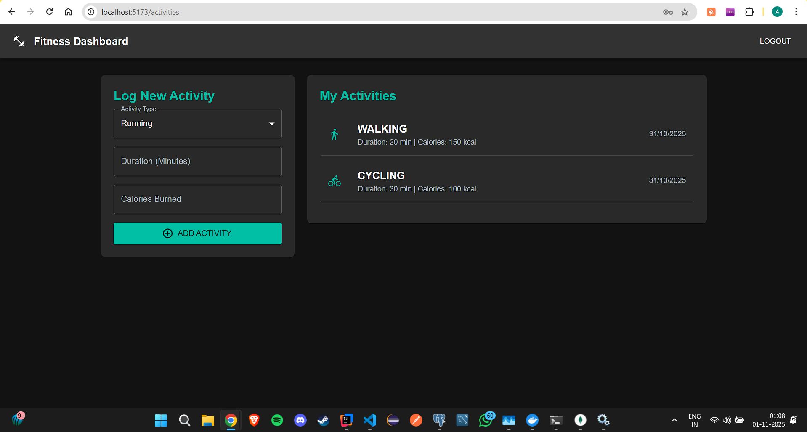
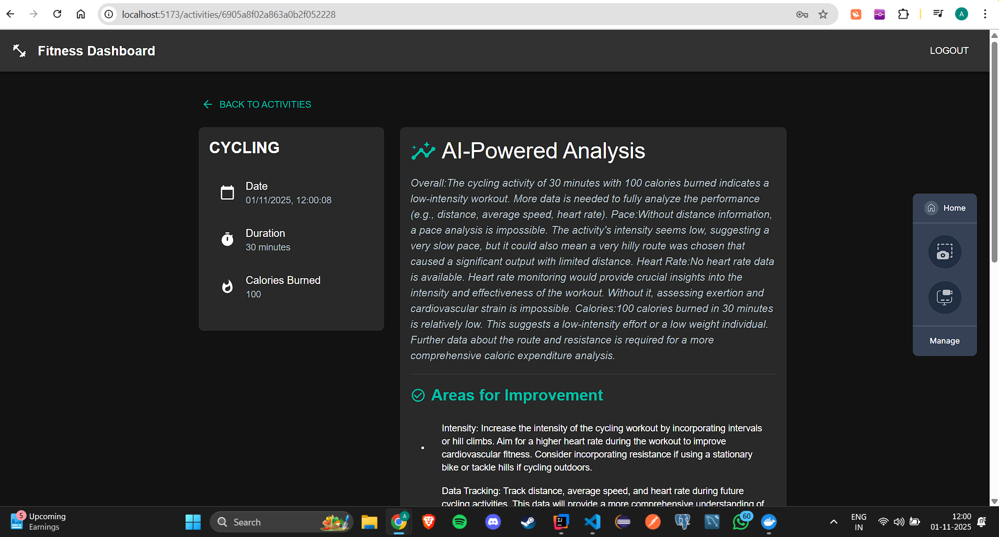

# 🚀 AI-Powered Fitness Tracker Microservice App

This is a comprehensive, full-stack application that provides a modern fitness tracking experience. It's built with a distributed microservice architecture on the backend and a reactive, modern frontend.

Users can create an account, log their fitness activities (running, cycling, etc.), and receive personalized, AI-powered insights and recommendations for their workouts.





---

## Key Backend Features

* **Microservice Architecture:** A distributed system built with **Spring Cloud**, featuring:
    * **Service Discovery (Eureka):** A central registry (`eurekaServer`) for all microservices.
    * **API Gateway (Spring Cloud Gateway):** A single entry point that secures, routes, and load-balances all API requests using their service names (e.g., `lb://USER-SERVICE`).

* **Secure Authentication:** End-to-end security using **Keycloak** as an OAuth 2.0 provider. The gateway validates JWTs on every request.

* **Event-Driven & Asynchronous:** Services are decoupled using **RabbitMQ**. When a new activity is logged, the `activityService` publishes a message, which the `aiService` consumes asynchronously for background processing.

* **Generative AI Integration:** The `aiService` calls the **Google Gemini API** to provide intelligent, personalized analysis and suggestions based on user workout data.

* **Polyglot Persistence:** A "database-per-service" design:
    * **PostgreSQL:** Stores relational user data for the `userService`.
    * **MongoDB:** Stores flexible document data for the `activityService` and `aiService`.

* **User Sync:** A custom filter on the `gateway` automatically registers users from Keycloak into the `userService` database on their first login.

---

## Tech Stack

| Category | Technology |
| :--- | :--- |
| **Backend** | Java 24, Spring Boot 3, Spring Cloud |
| **Frontend** | React, Vite, Redux, Material-UI (MUI) |
| **Security** | Spring Security, Keycloak (OAuth 2.0 & JWT) |
| **Databases** | PostgreSQL (`userService`), MongoDB (`activityService`, `aiService`) |
| **Messaging** | RabbitMQ (for asynchronous AI processing) |
| **Microservices** | Spring Cloud Gateway, Eureka Service Discovery |
| **AI** | Google Gemini API |
| **Build** | Maven, npm/Vite |

---

## How to Run

### 1. Prerequisites

* Java 24+
* Node.js 20+
* Docker Desktop (make sure it's running)
* Google Gemini API Key

### 2. Start External Services (with Docker Compose)

The `docker-compose.yml` file in the root directory will start Keycloak, PostgreSQL, MongoDB, and RabbitMQ with a single command.

1.  Open a terminal in the project's root directory.
2.  Run the following command:
    ```bash
    docker-compose up -d
    ```
    (To stop all services, run `docker-compose down`).

### 3. Configure Keycloak (One-Time Setup)

1.  Go to the **Keycloak Admin Console** at `http://localhost:8181`.
2.  Log in with username `admin` and password `admin`.
3.  Create a new Realm: `fitness-oauth2`.
4.  Go to **Clients** > **Create client**.
  * **Client ID:** `oauth2-pkce-client`
  * **Client authentication:** `Off`
  * **Valid Redirect URIs:** `http://localhost:5173`
5.  Go to **Realm Settings** > **Login** tab.
  * Toggle **User registration** to **ON**.
6.  Click **Save**.

### 4. Set Environment Variables

In your IDE, set these environment variables for the `aiService` run configuration:

* `GEMINI_API_URL`: `https://generativelanguage.googleapis.com/v1beta/models/gemini-1.5-flash-latest:generateContent?key=`
* `GEMINI_API_KEY`: `<YOUR_SECRET_GEMINI_KEY>`

### 5. Run Backend Services (In Order)

Run the `main` application class for each service in this sequence:

1.  **`eurekaServer`**
2.  **`userService`**
3.  **`activityService`**
4.  **`aiService`**
5.  **`gateway`**

Wait for each service to start successfully before starting the next.

### 6. Run the Frontend

1.  Open a new terminal in the `fitness-app-frontend` directory.
2.  Run `npm install`.
3.  Run `npm run dev`.
4.  Open **`http://localhost:5173`** in your browser.

You can now register a new user (via the Keycloak page) and start tracking activities!